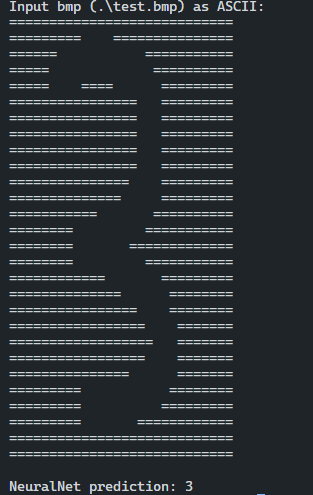

# taylohs MNIST Neural network

This is a naive implementation of a feed forward neural net, for learning purposes.  
Runs on CPU (single-thread), with stochastic gradient descent. Matrix/vector operations are not optimized. Allocs could be worse.  

MNIST is a database of handwritten digits that are used to train and test image classification software.

## Compile and run
Flags in main.c:  
`USE_BINARY_COLORS` - Setting this to 1 will load the MNIST images as binary colored images. The resulting network should be better at predicting e.g. mspaint drawn digits.

Recommended compilation (no optimization flags => 10x slower training)   
`gcc -O3 -march=native -ffast-math -o bin/mnist_nn.exe src/main.c src/mnist.c src/neuralnet.c src/bmp.c linalg/src/vector.c linalg/src/matrix.c`
 
### Train
To train a model:  
`bin/mnist_nn.exe --train params.txt modelfile`  
* Training parameters set in params.txt
* modelfile is the output model (binary)

Training output should look something like this (progress bar will only work on Windows):  

### Test
To test a model:  
`bin/mnist_nn.exe --test modelfile`  
* modelfile is the model created by --train to be tested

Testing output should look something like this:  

### Inference on custom bmp
To run inference on a bmp:  
`bin/mnist_nn.exe --infer image.bmp modelfile`

* The bmp must use 256-bit colors
* And, the digit must be black on a white background

Unfortunately, predictions are not at all as good as the testing results on the MNIST test data. This is a domain adaptation problem, and I probably wont spend much time trying to transform or filter the input bmps in such a way that it resembles the MNIST training data as much as possible.

## Specification
~ 70 15 15 train validate test split with 98.4 % accuracy on test (highest measured)  

Architecture: 784, 256, 10  

Parameters:
* learning_rate = 0.01f
* lambda/l2/weight decay = 0.0001f
* patience = 3
* max_epochs = 30
* activation function: ReLU
* loss function: Cross-Entropy
* initialization: He

## Dataset
https://www.kaggle.com/datasets/hojjatk/mnist-dataset